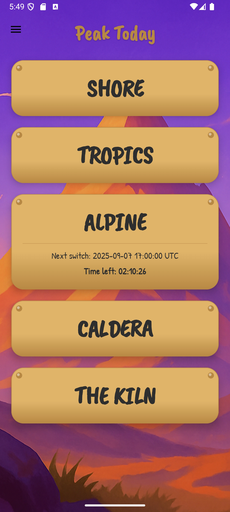

# Peak Today

## 📌 About

**Peak Today** is a non-commercial fan-made application that helps track the current map (biome) rotation in the game **[PEAK](https://landfall.se/peak)** by Landfall Games.

## ⚠ Disclaimer

This is an **unofficial project**. It is not affiliated with or endorsed by Landfall Games.
App is not using any original assets from the game.
All rights to **PEAK** and its assets belong to **Landfall Games**.
No copyright or trademark infringement is intended.

## 📱 Screenshots

## ✨ Features

- Display of the current active biomes
- Countdown timer for the next map switch
- Simple and clean themed UI

## 🔒 Privacy

- No ads, no trackers, no analytics
- Does not collect any data
- Does not require an internet connection

## 🚀 Installation

Go to the [Releases](https://github.com/vikindor/peak-maps-today/releases) page and download the latest APK.

## 🛠 Tech stack

- Kotlin
- Android SDK
- Jetpack Compose (UI)
- Material Design

## 📜 License

This project is licensed under the [MIT License](LICENSE).
